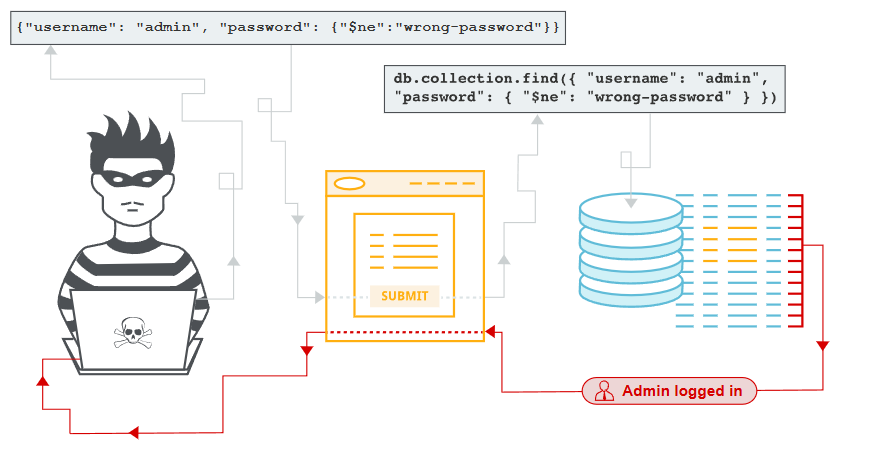

# NoSQL injection

## Tóm tắt

Cơ sở dữ liệu NoSQL cung cấp các hạn chế về consistency restrictions hơn so với cơ sở dữ liệu SQL truyền thống. Bằng cách yêu cầu ít ràng buộc quan hệ và kiểm tra tính nhất quán hơn, cơ sở dữ liệu NoSQL thường mang lại lợi ích về hiệu suất và khả năng mở rộng. Tuy nhiên, các cơ sở dữ liệu này vẫn có khả năng dễ bị tấn injection, ngay cả khi chúng không sử dụng cú pháp SQL truyền thống. Vì các cuộc tấn công NoSQL injection này có thể thực thi trong [procedural language](https://en.wikipedia.org/wiki/Procedural_programming), thay vì [declarative SQL language](https://en.wikipedia.org/wiki/Declarative_programming) , nên tác động tiềm ẩn lớn hơn so với tiêm SQL truyền thống.

Các lệnh gọi cơ sở dữ liệu NoSQL được viết bằng ngôn ngữ lập trình của ứng dụng, lệnh gọi API tùy chỉnh hoặc được định dạng theo quy ước chung (chẳng hạn như XML, JSON, LINQ, v.v.). Đầu vào độc hại nhắm vào các thông số kỹ thuật đó có thể không kích hoạt sanitization checks. Ví dụ, lọc ra các ký tự đặc biệt HTML phổ biến như `<` `>` `&` `;`sẽ không ngăn chặn các cuộc tấn công vào API JSON, trong đó các ký tự đặc biệt bao gồm `/` `{` `}` `:`.



## Cách kiểm tra lỗ hổng NoSQL injection trong MongoDB

API MongoDB mong đợi các lệnh gọi BSON (Binary JSON) và bao gồm một query assembly tool BSON an toàn. Tuy nhiên, theo MongoDB documentation - unserialized JSON và [JavaScript expressions](https://docs.mongodb.org/manual/faq/developers/#javascript) được phép trong một số tham số truy vấn thay thế. Lệnh gọi API được sử dụng phổ biến nhất cho phép nhập JavaScript tùy ý là toán tử `$where`.

Toán tử `$where` MongoDB thường được sử dụng như một bộ lọc hoặc kiểm tra đơn giản, giống như trong SQL.

```
db.myCollection.find( { $where: "this.credits`` ``==`` ``this.debits" } );
```
Tùy chọn JavaScript cũng được đánh giá để cho phép các điều kiện nâng cao hơn.

```
db.myCollection.find( { $where: function() { return obj.credits - obj.debits < 0; } } );
```

### Ví dụ 1
Nếu kẻ tấn công có thể thao túng dữ liệu được truyền vào toán tử `$where`, kẻ tấn công đó có thể include JavaScript tùy ý để được đánh giá như một phần của truy vấn MongoDB. Một ví dụ về lỗ hổng được nêu trong đoạn mã sau, nếu dữ liệu đầu vào của người dùng được truyển trực tiếp vào truy vấn MôngDB mà không qua xử lý.

```
db.myCollection.find( { active: true, $where: function() { return obj.credits - obj.debits < $userInput; } } );;
```

Để kiểm tra ta chỉ cần injection các ký tự đặc biệt có liên quan đến ngôn ngữ API mục tiêu và quan sát kết quả. Ví dụ, trong MongoDB, nếu một chuỗi chứa bất kỳ ký tự đặc biệt nào sau đây được truyền mà không được xử lý dúng cách, nó sẽ kích hoạt lỗi cơ sở dữ liệu.

```
' " \ ; { }
```

### Ví dụ 2

Trong MongoDB, cú pháp `$where` tự nó là một toán tử truy vấn được đặt trước. Nó cần được truyền vào truy vấn chính xác như được hiển thị; bất kỳ thay đổi nào cũng sẽ gây ra lỗi cơ sở dữ liệu. Tuy nhiên, vì `$where` cũng là một tên biến PHP hợp lệ, nên kẻ tấn công có thể chèn mã vào truy vấn bằng cách tạo một biến PHP có tên là `$where`. Tài liệu PHP MongoDB cảnh báo rõ ràng cho các nhà phát triển:
Hãy đảm bảo rằng đối với tất cả các toán tử truy vấn đặc biệt (bắt đầu bằng $), sử dụng dấu ngoặc đơn để PHP không cố thay thế` $exists` bằng giá trị của biến `$exists`.

Ngay cả khi truy vấn không phụ thuộc vào dữ liệu đầu vào của người dùng, chẳng hạn như ví dụ sau, kẻ tấn công vẫn có thể khai thác MongoDB bằng cách thay thế toán tử bằng dữ liệu độc hại.

```
db.myCollection.find( { $where: function() { return obj.credits - obj.debits < 0; } } );
```

## Ngăn chặn 
Cách thích hợp để ngăn chặn các cuộc tấn công NoSQL injection phụ thuộc vào công nghệ NoSQL cụ thể đang sử dụng. Một số phương pháp chung sau đây sẽ hữu ích:

- Khử trùng và xác thực thông tin đầu vào của người dùng bằng cách sử dụng danh sách các ký tự được chấp nhận.
- Chèn dữ liệu đầu vào của người dùng bằng các truy vấn có tham số thay vì nối dữ liệu đầu vào của người dùng trực tiếp vào truy vấn.

Ví dụ, MongoDB có các tính năng tích hợp để xây dựng truy vấn an toàn mà không cần JavaScript. Nếu cần sử dụng JavaScript trong các truy vấn, hãy làm theo các biện pháp thực hành tốt nhất thông thường: xác thực và mã hóa tất cả dữ liệu đầu vào của người dùng, áp dụng quy tắc đặc quyền tối thiểu.
