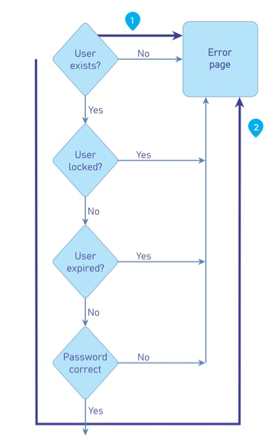

# Process Timing

## Mô tả

Có khả năng kẻ tấn công có thể thu thập thông tin về ứng dụng bằng cách theo dõi thời gian hoàn thành tác vụ hoặc đưa ra phản hồi. Ngoài ra, kẻ tấn công có thể thao túng và phá vỡ các luồng quy trình kinh doanh được thiết kế chỉ bằng cách giữ các phiên hoạt động mở và không gửi giao dịch của họ trong khung thời gian xác định.

Thời gian xử lý có thể cung cấp/rò rỉ thông tin về những gì đang được thực hiện trong các quy trình background của application/system. Nếu một ứng dụng cho phép người dùng đoán kết quả tiếp theo cụ thể sẽ là gì bằng cách xử lý các biến thể thời gian, người dùng sẽ có thể điều chỉnh phù hợp và thay đổi hành vi dựa trên expectation và "game the system".

## ví dụ 

Nhiều quy trình đăng nhập hệ thống yêu cầu tên người dùng và mật khẩu. Nếu bạn xem xét kỹ, bạn có thể thấy rằng việc nhập tên người dùng và mật khẩu người dùng không hợp lệ mất nhiều thời gian hơn để trả về lỗi so với việc nhập tên người dùng và mật khẩu người dùng hợp lệ. Điều này có thể cho phép kẻ tấn công biết liệu họ có tên người dùng hợp lệ hay không và không cần phải dựa vào thông báo GUI.

## Yêu cầu 
Phát triển các ứng dụng có tính đến thời gian xử lý. Nếu kẻ tấn công có thể đạt được một số lợi thế từ việc biết được thời gian xử lý và kết quả khác nhau, hãy thêm các bước hoặc xử lý bổ sung để bất kể kết quả nào cũng được cung cấp trong cùng một khung thời gian.

Ngoài ra, ứng dụng/hệ thống phải có cơ chế để không cho phép kẻ tấn công kéo dài giao dịch trong khoảng thời gian "có thể chấp nhận được". Điều này có thể được thực hiện bằng cách hủy hoặc đặt lại giao dịch sau khi một khoảng thời gian cụ thể đã trôi qua.