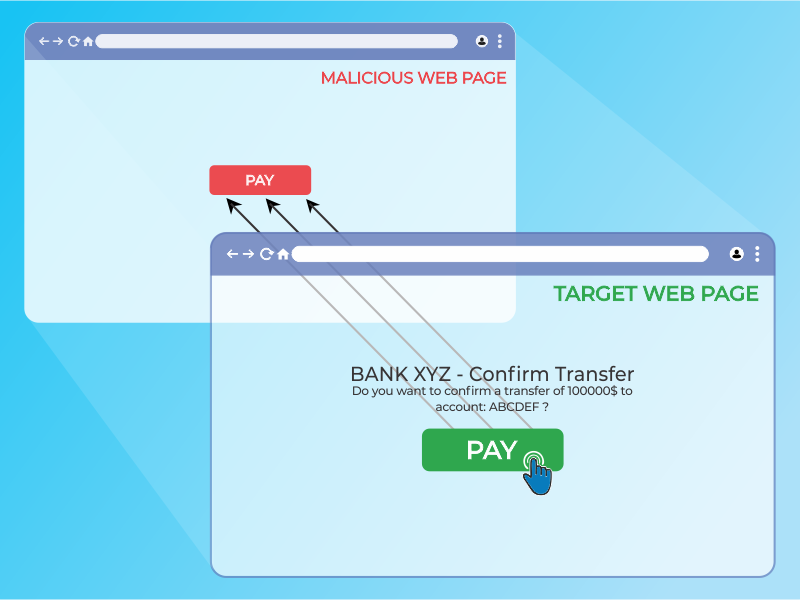
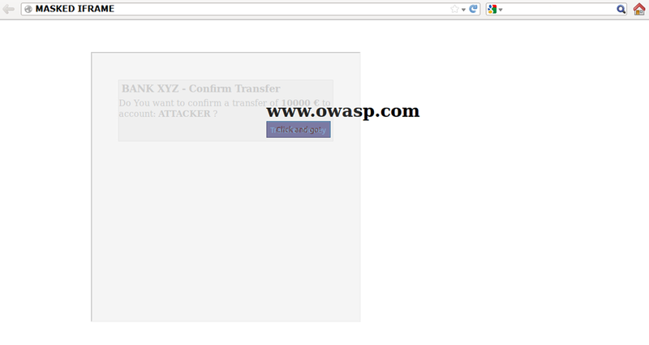

# Clickjacking

## Mô tả 

Clickjacking, một tập hợp con của UI redressing, là một kỹ thuật độc hại trong đó người dùng web bị lừa tương tác (trong hầu hết các trường hợp bằng cách nhấp chuột) với thứ gì đó khác với thứ mà người dùng tin rằng họ đang tương tác. Kiểu tấn công này, dù là đơn lẻ hay kết hợp với các cuộc tấn công khác, có khả năng gửi các lệnh trái phép hoặc tiết lộ thông tin bí mật trong khi nạn nhân đang tương tác với các trang web có vẻ vô hại. Thuật ngữ clickjacking được Jeremiah Grossman và Robert Hansen đặt ra vào năm 2008.

Một cuộc tấn công clickjacking sử dụng các tính năng có vẻ vô hại của HTML và JavaScript để buộc nạn nhân thực hiện các hành động không mong muốn, chẳng hạn như nhấp vào một nút vô hình thực hiện một thao tác không mong muốn. Đây là sự cố bảo mật phía máy khách ảnh hưởng đến nhiều trình duyệt và nền tảng.

Để thực hiện cuộc tấn công này, kẻ tấn công tạo một trang web có vẻ vô hại tải ứng dụng mục tiêu thông qua việc sử dụng inline frame (concealed with CSS code).
Sau khi thực hiện xong, kẻ tấn công có thể dụ nạn nhân tương tác với trang web bằng các phương tiện khác (ví dụ như thông qua kỹ thuật xã hội). Giống như các cuộc tấn công khác, điều kiện tiên quyết chung là nạn nhân phải được xác thực với ứng dụng mục tiêu của kẻ tấn công.

Nạn nhân lướt trang web của kẻ tấn công với mục đích tương tác với giao diện người dùng hiển thị, nhưng vô tình thực hiện các hành động trên trang web ẩn. Sử dụng trang ẩn, kẻ tấn công có thể lừa người dùng thực hiện các hành động mà họ không bao giờ có ý định thực hiện thông qua việc định vị các thành phần ẩn trong trang web.

## Yêu cầu 

### Bảo vệ bằng cách sử dụng Content Security Policy (CSP) frame-ancestors

`frame-ancestors` directive có thể được sử dụng trong tiêu đề phản hồi HTTP Content-Security-Policy để chỉ ra liệu trình duyệt có được phép hiển thị trang trong `<frame>` hay `<iframe>` hay không.Các trang web có thể sử dụng tính năng này để tránh các cuộc tấn công Clickjacking bằng cách đảm bảo rằng nội dung của trang web không được nhúng vào các trang web khác.

`frame-ancestors` cho phép một trang web cấp quyền cho nhiều miền bằng cách sử dụng Content Security Policy semantics thông thường.

#### Content-Security-Policy: frame-ancestors
Những cách sử dụng phổ biến của CSP frame-ancestors:
- `Content-Security-Policy: frame-ancestors 'none';`: Ngăn không cho trang web được nhúng vào frame/iframe trên bất kỳ trang web nào khác
- `Content-Security-Policy: frame-ancestors 'self';` : Cho phép trang web được nhúng trong frame từ cùng origin (same origin)
- `Content-Security-Policy: frame-ancestors 'self' *.somesite.com https://myfriend.site.com;` : Điều này cho phép trang web hiện tại cũng như bất kỳ trang nào trên somesite.com (sử dụng bất kỳ giao thức nào) và chỉ trang myfriend.site.com, chỉ sử dụng HTTPS trên cổng mặc định (443).

### Bảo vệ bằng header response X-Frame-Options
Tiêu đề phản hồi HTTP `X-Frame-Options` có thể được sử dụng để chỉ ra liệu trình duyệt có được phép hiển thị trang trong `<frame>` hay `<iframe>` hay không. Các trang web có thể sử dụng điều này để tránh các cuộc tấn công Clickjacking, bằng cách đảm bảo rằng nội dung của họ không được nhúng vào các trang web khác. Đặt tiêu đề X-Frame-Options cho tất cả các phản hồi có chứa nội dung HTML. Các giá trị có thể là "DENY", "SAMEORIGIN" hoặc "ALLOW-FROM uri"

#### X-Frame-Options Header Types
Có ba giá trị có thể có cho tiêu đề X-Frame-Options:
- **X-Frame-Options: DENY**
  - Chặn hoàn toàn việc nhúng trang web vào frame/iframe
  - Mức bảo mật cao nhất
  - Không có ngoại lệ, kể cả same origin
- **X-Frame-Options: SAMEORIGIN**
  - Chỉ cho phép nhúng từ cùng origin
  - Origin bao gồm: protocol + domain + port
  - Phù hợp cho hệ thống có iframe nội bộ
- **X-Frame-Options: ALLOW-FROM https://example.com/**
  - Cho phép nhúng từ domain cụ thể
  - Đã bị deprecated trên nhiều trình duyệt
  - Thay thế bằng CSP frame-ancestors